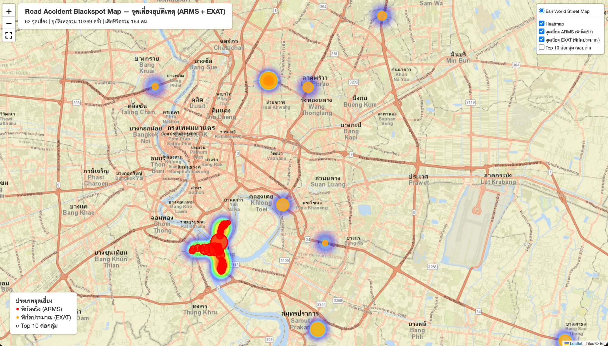

# Road Accident Blackspot Pipeline

A data pipeline that pulls road accident data from two Thai government open data sources, cleans and combines it, groups nearby accidents into "blackspots," scores how dangerous each one is, and publishes the result as a public, interactive map — no login required.

**🗺️ Live demo:** https://alongkron1234.github.io/Road-Accident-Blackspot/



---

## Why this project exists

Road accident data in Thailand is scattered across different government agencies, each publishing it in a different format. Nobody had put it all together to answer a simple question: *which specific spots keep having accidents, over and over?* That's exactly the kind of information that helps everyday drivers plan safer routes and helps road safety authorities decide where to focus their attention.

## What it actually does, in one paragraph

Every day, the pipeline downloads accident records from two sources, stores them untouched in a database, then transforms them: normalizing the two very different data formats into one, grouping accidents that happened close together into clusters, and scoring each cluster by how severe and how frequent its accidents have been. Before anything gets published, automated data quality checks run — if something looks wrong, the bad data never reaches the public map. The final result is rendered as a heatmap + marker map and pushed to a public website automatically.

As of the latest run, the map shows **62 blackspots** built from **10,369 accident records**, including **164 fatalities**.

---

## Data Sources

| Source | Agency | How it's fetched | Coverage | Has coordinates? |
|---|---|---|---|---|
| ARMS accident data | Department of Rural Roads | Static file downloads (1 JSON + 3 CSV files, one per fiscal year) from `dataportal.drr.go.th` | ~3,000+ records (FY2022–2025) | ✅ Yes, real GPS coordinates |
| EXAT accident data | Expressway Authority of Thailand | REST API, `exat-man.web.app/api/EXAT_Accident/{Thai year}/{month}` | Monthly records per expressway | ❌ No — only the expressway's name as text |

Both are published on [datagov.mot.go.th](https://datagov.mot.go.th), the Ministry of Transport's open data portal, under an open license. Details and sample responses are documented in [`docs/api_notes.md`](docs/api_notes.md).

**A key data quality note:** EXAT never gives exact accident coordinates — only the name of the expressway. To still make use of this data, the pipeline maps each expressway name to an approximate representative coordinate (looked up manually on Google Maps, documented in [`docs/expw_step_coordinates_notes.md`](docs/expw_step_coordinates_notes.md)). This means EXAT-based blackspots on the map represent "which expressway is risky," not "which exact point on it" — the map visually distinguishes these from precise ARMS-based points so nobody mistakes one for the other.

---

## Architecture & Data Flow (ELT)

This project follows an **ELT** pattern — Extract, Load, and only *then* Transform — rather than the more traditional ETL (transform-before-load). Here's the flow from raw API to public map:

```
┌──────────────┐        ┌──────────────┐
│   ARMS API   │        │   EXAT API   │
│ (rural roads)│        │ (expressways)│
└──────┬───────┘        └──────┬───────┘
       │                       │
       │      1. EXTRACT       │   Python scripts download raw
       └───────────┬───────────┘   files/responses, with retries
                    ▼
             2. LOAD (raw)
      raw_arms  /  raw_exat  tables
      (PostgreSQL, stored as JSONB,
       completely untouched/unparsed)
                    │
                    │  3. TRANSFORM — staging (dbt)
                    ▼         unpack JSON into real columns,
             stg_accidents    drop out-of-Thailand coordinates,
                    │         merge both sources into one shape
                    │
                    │  4. TRANSFORM — clustering (dbt + PostGIS)
                    ▼         group nearby repeat accidents together
        int_accident_clusters  using DBSCAN
                    │
                    │  5. TRANSFORM — mart (dbt)
                    ▼         aggregate per cluster, compute a
       mart_blackspot_severity  severity score, rank the results
                    │
                    │  6. TEST (dbt tests)
                    ▼         data quality gate — bad data never
              (pass / fail)   reaches the steps below
                    │
                    │  7. PUBLISH
                    ▼
         Folium map → GitHub Pages
           (this is the live demo link above)
```

### Why ELT instead of ETL

The raw data is loaded into Postgres first, completely unmodified. All the actual transformation logic lives in dbt, running as plain SQL inside the database itself. The benefit: if the clustering radius or the severity formula ever needs tweaking, it's just a matter of re-running dbt against the raw data that's already sitting in Postgres — there's no need to re-fetch months of historical data from the government APIs all over again.

### Current automation status

Steps 1–2 (extract and load) are already fully automated through a daily Airflow DAG. Steps 3–7 (dbt transforms, tests, and map publishing) currently run manually and are being wired into the same DAG next — see [Limitations](#limitations--known-issues) below and [`PLAN.md`](PLAN.md) for the full roadmap.

---

## Tech Stack

| Layer | Tool | Why |
|---|---|---|
| Orchestration | Apache Airflow | Runs the daily extract + load pipeline, with retries |
| Database | PostgreSQL + PostGIS | Stores everything, raw through final; PostGIS adds the geospatial clustering function |
| Transformation | dbt | SQL-based transforms with built-in dependency management and data tests |
| Clustering | PostGIS `ST_ClusterDBSCAN` | Groups accidents that happened within ~50 meters of each other |
| Mapping | Folium (Python, built on Leaflet.js) | Generates the interactive heatmap + marker map |
| Hosting | GitHub Pages | Free static hosting, no server to maintain |
| Language | Python (extraction, orchestration) + SQL (dbt models) | |

---

## Project Structure

```
├── airflow/
│   └── dags/
│       └── extract_load_dag.py       # daily DAG: extract ARMS+EXAT -> load into raw tables
│
├── dbt/                               # all data transformation lives here, as plain SQL
│   ├── dbt_project.yml                # dbt project config (name, folder layout)
│   ├── profiles.yml                   # DB connection config (reads credentials from .env)
│   ├── models/
│   │   ├── sources.yml                # declares raw_arms/raw_exat as dbt sources
│   │   ├── staging/
│   │   │   ├── stg_arms_json.sql      # unpacks the ARMS JSON export
│   │   │   ├── stg_arms_csv.sql       # unpacks the 3 ARMS CSV exports (different schema than JSON)
│   │   │   ├── stg_exat.sql           # unpacks EXAT + geocodes it via the seed below
│   │   │   ├── stg_accidents.sql      # unions all three into one clean, deduplicated table
│   │   │   └── schema.yml             # column docs + data tests for the models above
│   │   ├── intermediate/
│   │   │   ├── int_accident_clusters.sql  # DBSCAN clustering via PostGIS
│   │   │   └── schema.yml
│   │   └── marts/
│   │       ├── mart_blackspot_severity.sql  # final aggregated, scored, ranked output
│   │       └── schema.yml
│   ├── seeds/
│   │   └── expw_step_coordinates.csv  # manual expressway-name -> coordinate lookup table
│   └── tests/                         # custom singular tests (e.g. coordinates must be in Thailand)
│
├── extract/
│   ├── arms_extractor.py              # downloads the 4 ARMS files (1 JSON + 3 CSV)
│   ├── exat_extractor.py              # loops EXAT's REST API by year/month
│   └── loader.py                      # loads raw files into Postgres (idempotent)
│
├── scripts/
│   ├── generate_map.py                # builds the Folium map from mart_blackspot_severity
│   ├── publish_map.py                 # commits + pushes the generated map to GitHub Pages
│   ├── create_raw_tables.sql          # one-off: creates the raw_arms/raw_exat tables
│   ├── enable_postgis.sql             # one-off: enables the PostGIS extension
│   ├── init-db.sql                    # runs automatically on first container start
│   ├── api_probe.py                   # early-stage script used to explore both APIs by hand
│   └── exat_year_probe.py             # one-off: found which years EXAT's API actually supports
│
├── tests/                             # pytest unit tests for the extractors/loader (mocked HTTP)
│
├── docs/
│   ├── index.html                     # the generated map — this is what GitHub Pages serves
│   ├── api_notes.md                   # detailed findings from exploring both APIs
│   ├── api_samples/                   # trimmed real sample responses from both APIs
│   ├── local_setup.md                 # step-by-step local setup + troubleshooting
│   ├── clustering_parameters_notes.md # why these DBSCAN settings were chosen
│   ├── severity_score_notes.md        # why the severity formula is weighted the way it is
│   ├── expw_step_coordinates_notes.md # how each expressway's approximate coordinate was picked
│   └── dbt_test_airflow_plan.md       # plan for wiring dbt tests into the Airflow DAG
│
├── docker-compose.yml                 # local Postgres (+ PostGIS) and Airflow setup
├── requirements.txt                   # Python dependencies
├── .env.example                       # required environment variables (copy to .env)
└── PLAN.md                            # the full project plan, broken down issue by issue
```

---

## Running It Locally

```bash
git clone <repo-url>
cd Road_Accident\ Blackspot_Pipeline
cp .env.example .env      # fill in real values before continuing
docker compose up -d
```

- Airflow UI: `http://localhost:8081`
- Postgres: `localhost:5433`

Full step-by-step setup, including troubleshooting common issues, is in [`docs/local_setup.md`](docs/local_setup.md).

To run the dbt transforms yourself once the containers are up:

```bash
pip install -r requirements.txt
dotenv -f .env run -- dbt run --project-dir dbt --profiles-dir dbt
dotenv -f .env run -- dbt test --project-dir dbt --profiles-dir dbt
python scripts/generate_map.py
```

---

## Limitations & Known Issues

Being upfront about what this project doesn't do (yet), or does imperfectly:

- **EXAT coordinates are approximations, not exact locations.** As explained above, EXAT only provides an expressway name, not GPS coordinates. Blackspots built from EXAT data represent "which expressway," not "which exact spot" — the map marks these differently from precise ARMS-based points.
- **The raw layer keeps every daily snapshot, including duplicates.** Since the same historical accident gets re-downloaded every day, the raw tables accumulate repeated copies over time. This is deduplicated at the staging layer (keeping only the most recently loaded copy of each accident), so final results are correct, but it does mean the raw tables themselves grow faster than the actual accident count.
- **One coordinate projection is used for the whole country.** Clustering distances are calculated using the UTM Zone 47N projection, which covers most, but not all, of Thailand — accidents in the easternmost provinces have slightly less accurate distance calculations as a result. In practice this has a negligible effect on the results.
- **Full daily automation isn't wired end-to-end yet.** The Airflow DAG currently automates extraction and loading; running dbt, the data quality tests, and re-publishing the map are still manual steps (tracked as upcoming work in [`PLAN.md`](PLAN.md)).
- **No authentication, and there doesn't need to be one.** The published map is read-only and intended for public use, so there's no login system, rate limiting, or write access to worry about.

---

## What's Next

The full task breakdown, organized issue by issue with its own branch, is documented in [`PLAN.md`](PLAN.md). In short: wiring the remaining pipeline steps into one fully automated daily Airflow run, and a couple of optional stretch goals afterward (a small public API, and a LINE bot that warns you about blackspots along your route).
